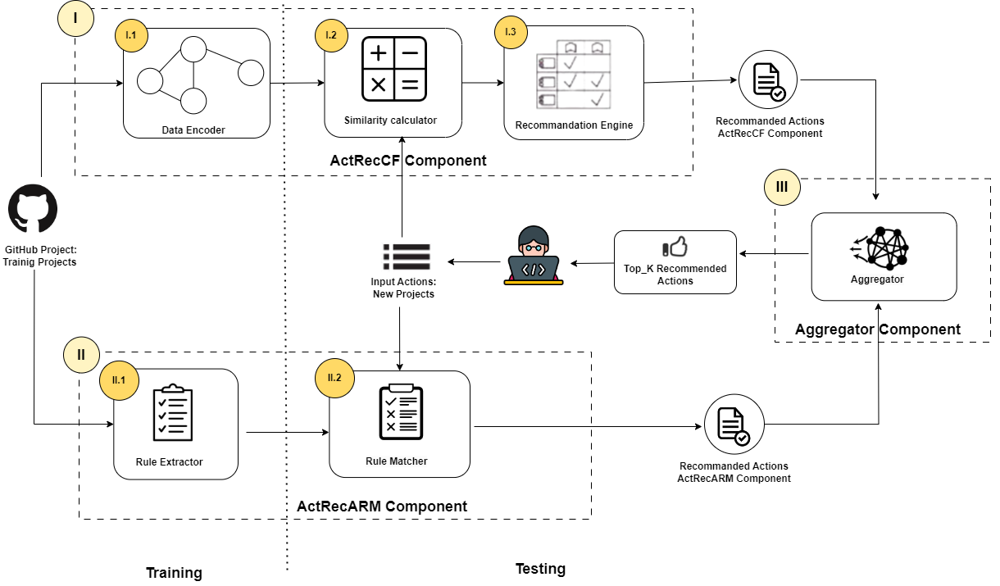
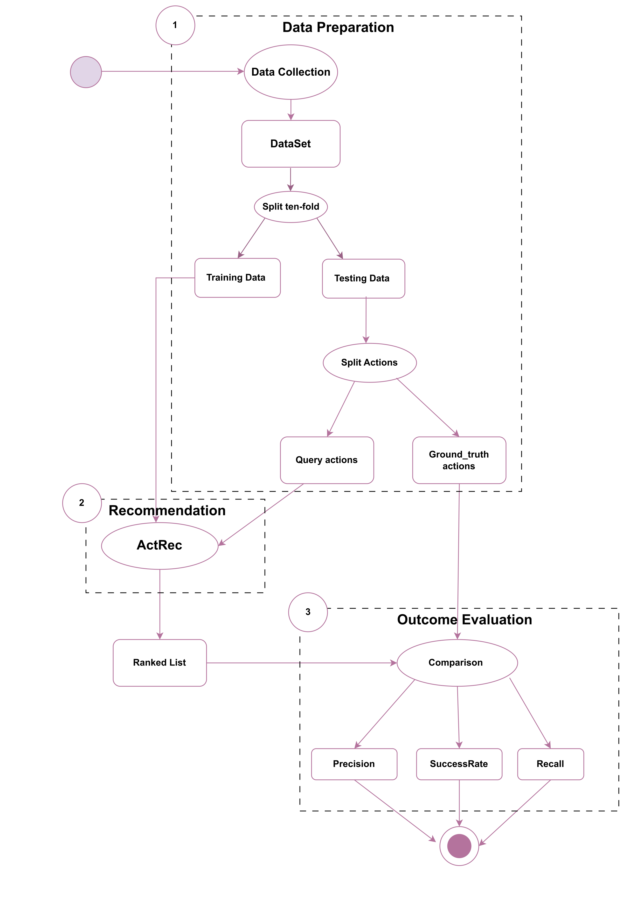

# ActRec
This repository contains the source code implementation of ActRec, the datasets and the results exprementation :

_ActRec: Hybrid Recommendation Approach for GitHub Actions_

## Introduction

In the realm of software development, GitHub Actions has emerged as a popular platform for automating
workflows and enhancing collaboration among developers. GitHub Actions allows developers to define custom CI/CD (Continuous Integration/Continuous Deployment) pipelines, enabling them to automate various tasks such as building, testing, and deploying their applications directly from their GitHub repositories.

## ActRec
The proposed ActRec approach consists of three major components: ActRecCF, ActRecARM, and an Aggregator. ActRecCF models relationships among open-source software projects using a graph representation, while ActRecARM mines patterns of action usage through association rules. The Aggregator combines the outcomes of both components to offer a unified set of recommendations. The ActRec architecture is as follows:

The label (I) in the Figure represents the architecture designed specifically for implementing the <b>ActRecCF</b> component. This component utilizes a Collaborative Filtering approach to recommend actions based on those employed by similar projects.
1. The <i>Data Encoder</i> collects background data from OSS repositories, represents them in a project-action ratings matrix   which is then used as a base for other components of ActRecCF. 
2. The <i> Similarity Calculator</i> module computes similarities among projects to find the most similar ones to the given project. 
3. The <i>Recommendation Engine</i> gets the list of <i> top-N</i> similar projects and executes recommendation techniques to generate a ranked list of <i> top-K </i> actions.

The label (II) in the Figure represents the architecture designed specifically for implementing the <b>ActRecARM</b> component. This component leverages the power of Association Rule Mining to recommend actions, utilizing the Apriori algorithm .
1. <i>RuleExtractor</i> takes the project-action matrix as input, converts it into transactions, applies the Apriori algorithm for frequent itemset mining, and sorts the generated association rules in descending order based on their maximum confidence, allowing the identification of the most confident rules indicating strong associations between actions in GitHub projects.
2. <i>RuleMatcher</i>  takes a new project and its current actions, compares them against association rules generated by RuleExtractor, and recommends actions to the project based on the highest confidence score among matching rules whose postcondition contains the recommended action.

The <b>Aggregator</b> component ``label (III)`` combines the recommendations from Collaborative Filtering and Association Rule Mining approaches by prioritizing high-scoring actions from each approach, ensuring a comprehensive and refined set of actions for more effective and relevant recommendations.

## Evaluation 

The ActRec approach has been evaluated using ten-fold cross-validation, considering various metrics such as success rate, precision, and recall. The results demonstrate that ActRec outperforms the individual Collaborative Filtering and Association Rule Mining approaches, indicating its superior performance in providing more accurate and effective recommendations for GitHub projects utilizing GitHub Actions. The evaluation process is as follows:

## Structure
There are the following main folders:

1. <b>Results</b>: contains all the results obtained from the experiments with ActRecCF, ActRecARM and ActRec.

2. <b>D2</b>: contains the input DataSet needed for our approach.

2. <b>tool</b>: Following the instruction provided in the folder, you can setup and run the source code using the dataset exist in D2 .
